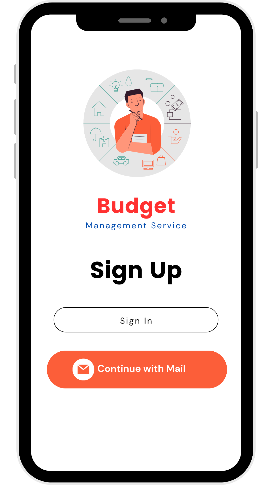
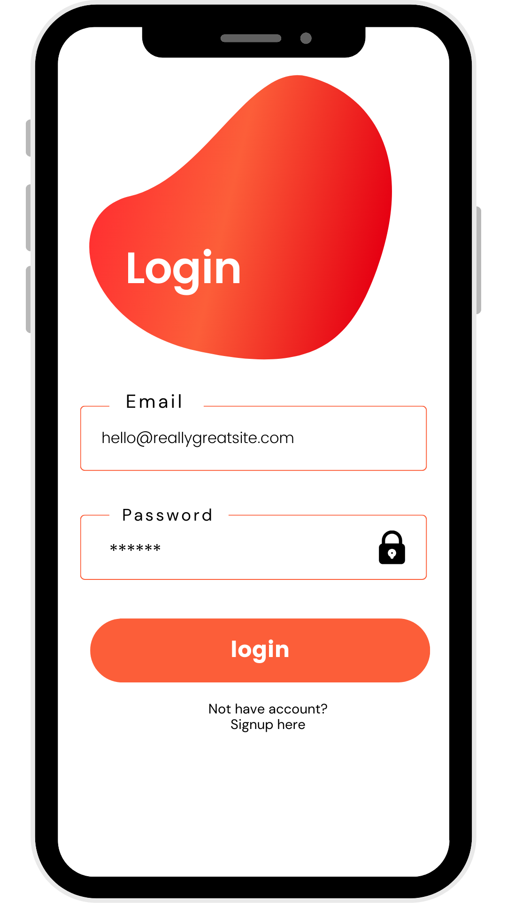
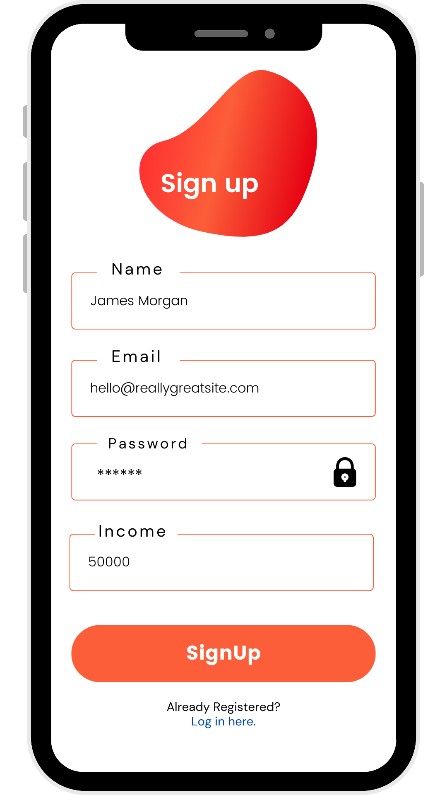
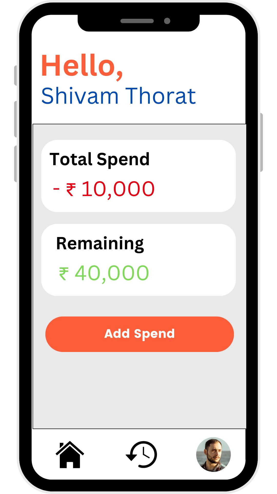
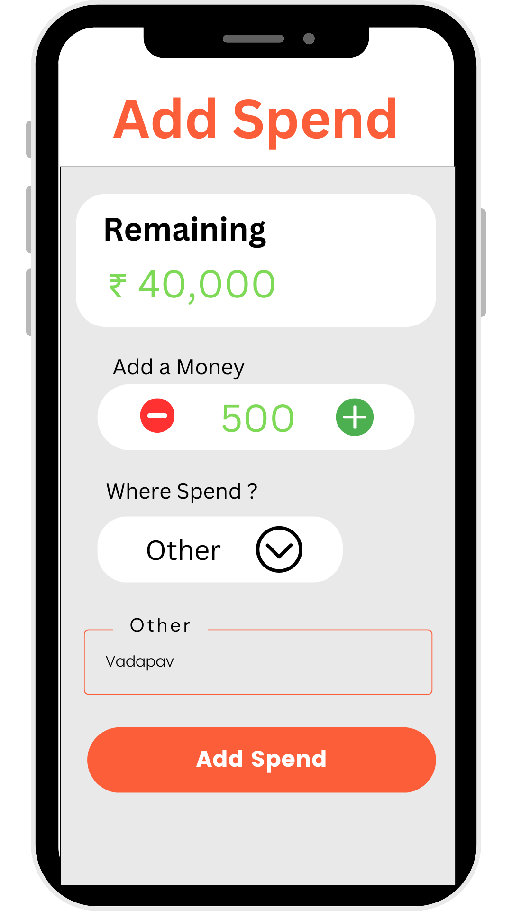
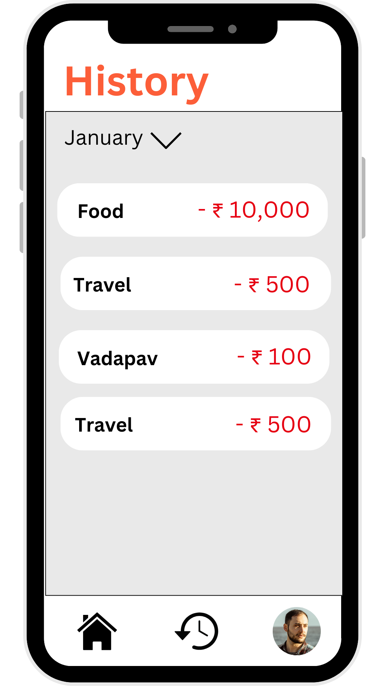

# Budget Management App

## Introduction

The **Budget Management App** is a mobile application designed to help users effectively manage their daily, weekly, and monthly expenses. It enables users to track their spending across various categories, set budgets, and visualize their expenses over time. The app is built using Flutter for the frontend and Java Spring Boot for the backend, providing a smooth, responsive, and user-friendly interface.

This project is ideal for those who want to gain control over their finances and monitor their spending habits. Users can input expenses, categorize them, and get insightful reports on how they are managing their money.





## App Features

- **Expense Input & Tracking:**  
  Users can add expenses, specifying the amount, category (e.g., food, travel, shopping), and date.
  
- **Expense Categories:**  
  Pre-defined categories for easier tracking (e.g., groceries, rent, utilities, entertainment), with options for users to create custom categories.
  
- **Budget Limit Setting:**  
  Users can set monthly, weekly, or daily budget limits to ensure they don’t overspend in specific categories or overall.

- **Real-time Expense Summary:**  
  A quick overview of the total spent in a day, week, or month with real-time updates.

- **Expense Breakdown:**  
  Visual breakdown of expenses through pie charts and bar graphs, showing how much has been spent in each category.


- **Data Sync:**  
  Sync data across multiple devices with cloud integration, ensuring access to expense records anywhere.






## Contributors


[](https://github.com/shivammm21)
[](https://github.com/varunthakare)

## Technologies Used

### Frontend:
- **Flutter:**  
  Used for building the user interface of the app, ensuring a smooth and responsive experience on both Android and iOS platforms.
  
- **Dart:**  
  The programming language used to develop Flutter apps. Dart's fast performance and compilation enhance the app's speed and efficiency.

### Backend:
- **Java Spring Boot:**  
  Provides RESTful APIs for handling user data, budgets, and expenses. It also manages user authentication and handles communication with the database.

- **MySQL:**  
  A robust relational database used for storing user data, expense records, categories, and budget limits.

### Other Tools:
- **Postman:**  
  Used for testing the API endpoints created in the backend.
  
- **Git & GitHub:**  
  Version control system for managing the project’s source code and facilitating collaboration.
  
- **VS Code & IntelliJ IDEA:**  
  IDEs used for Flutter and Java Spring Boot development respectively.

## How to Run the Project

1. **Clone the Repository :**
   ```bash
   git clone https://github.com/shivammm1/budget-app.git
   cd budget-app
2. **Install Dependencies :**
   ```bash
   flutter pub get  
3. **Run the App :**
   ```bash
   flutter run    
4. **Backend Setup :**
   - **Step 1: Java JDK Installation**<br>
      **Download and install Java JDK (Java Development Kit) version 11 or above from the <a href src="https://www.oracle.com/java/technologies/javase/jdk17-archive-downloads.html">official Oracle website</a>.**

   - **After installation, verify the installation by running**  
   ```bash
   java -version 
- **Step 2: Spring Boot Setup**<br>
    - **Ensure Spring Boot is set up correctly. You can create a Spring Boot project using <a href="https://start.spring.io/">Spring Initializr</a> or set it up in your preferred IDE like IntelliJ IDEA.**
    - **To run the Spring Boot application, make sure you have Maven or Gradle installed, or let your IDE handle the build process.**
    - **Configure the Database: In your Spring Boot project, locate the application.properties or application.yml file and set the MySQL connection details as shown below:**
        ```bash
          spring.datasource.url=jdbc:mysql://localhost:3306/budget_app_db
          spring.datasource.username=your_mysql_username
          spring.datasource.password=your_mysql_password
          spring.jpa.hibernate.ddl-auto=update
          spring.jpa.show-sql=true
    - **Start the Spring Boot backend:**
        ```bash
            ./mvnw spring-boot:run   # For Maven projects
            ./gradlew bootRun         # For Gradle projects
- **Step 3: MySQL Setup**<br> 
    - **Download and install MySQL if you don’t already have it installed. You can download MySQL from the official website.**
    - **Create a database:**
      ```bash
          CREATE DATABASE budget_app_db;
5. **API Testing :**<br>
     - **Use Postman to test the API endpoints provided by the Spring Boot backend. You can send GET, POST, PUT, and DELETE requests to verify if the backend is interacting with the database and performing operations correctly.**
    - Example API endpoint testing with Postman
        - GET /expenses – Fetch all user expenses.
        - POST /expenses – Add a new expense entry.

 ### Java JDK & Spring Boot Version Details
    
The backend requires Java JDK 11 or later. Java 11 is an LTS (Long-Term Support) version, making it suitable for production applications.

Spring Boot Version:
The backend is built using Spring Boot 2.7.x or higher. Spring Boot provides a simple and streamlined way to create production-ready Spring applications with embedded web servers like Tomcat or Jetty.

Dependencies Used in Spring Boot:

Spring Web: To create RESTful web services.
Spring Data JPA: To interact with the MySQL database using Java Persistence API (JPA).
MySQL Connector: For connecting the Spring Boot application to a MySQL database.


